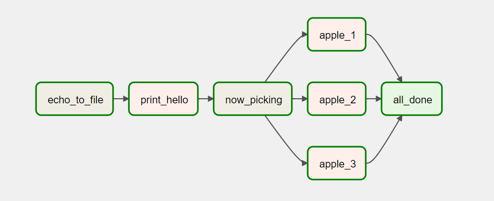

# Airflow Orchard
#### by Jess Schueler

### *An Apache Airflow example DAG*

## Technologies Used
* Python
* Apache Airflow
* Bash

## Description

An Apache Airflow DAG that uses Bash to create a text file, reads and prints that file with Python, creates three simultaneous tasks by making random selections from a list, and ensures everything ran by finishing with an empty operator.



## Setup/Installation Requirements
* In the terminal, clone github repository using the following command;
    ```
    $ git clone https://github.com/jessgschueler/airflow-orchard
    ```
* In a venv, Pip install requirements.txt file
* From inside the main directory, set the .env;
    ```
    echo -e "AIRFLOW_UID=$(id -u)\nAIRFLOW_GID=0" > .env
    ```
* Initialize Airflow 
    ```
    docker-compose up airflow-init
    ```
* Run the DAG in the Airflow GUI from http://localhost:8080

## Known Bugs
* None at this time

## License
MIT

Copyright (c) 6/17/22 Jess Schueler
